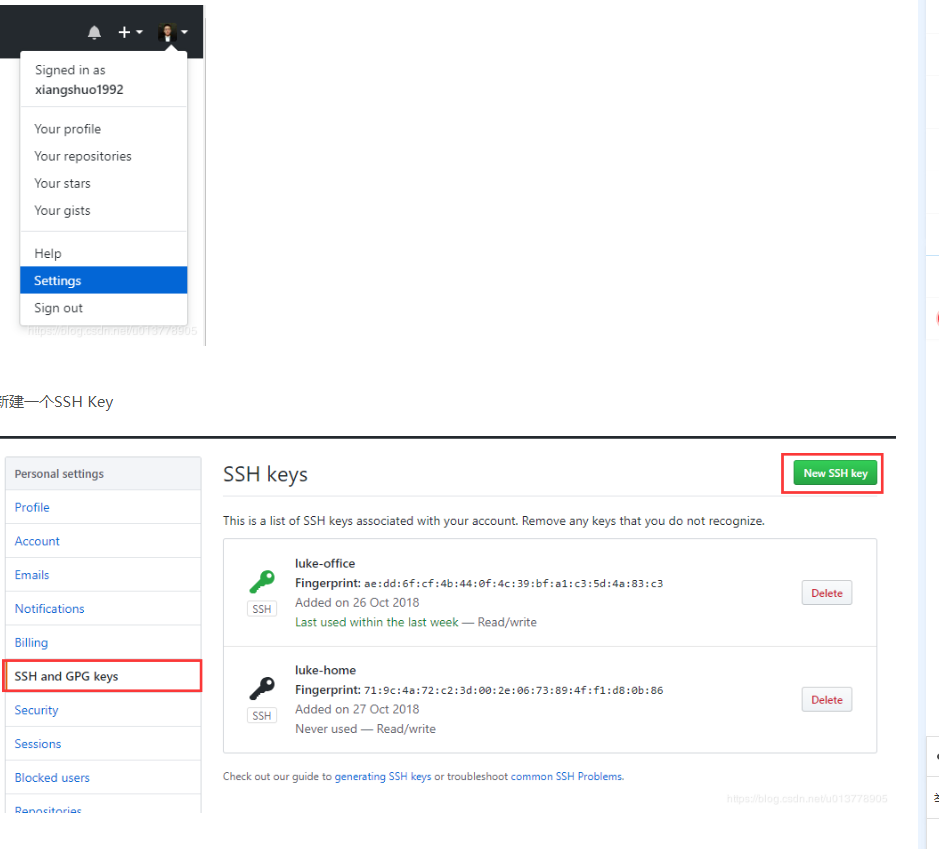
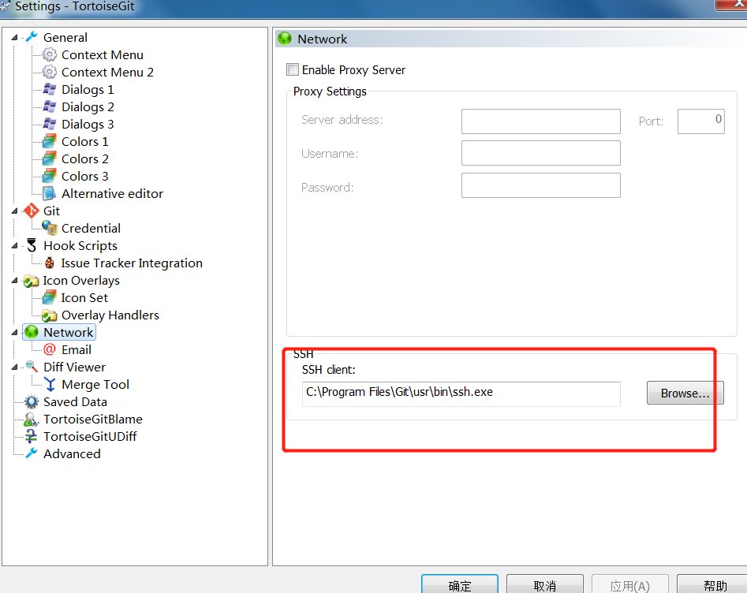

项目python的版本  3.7.4

django的版本 2.2


git的使用方法

github 本地仓库搭建

1. 在要提交的文件根目录进行初始化仓库
   git init
2. 添加全部文件
   git add .
3. 提交文件
   git commit -t “提交”
4. 进入Github,建立仓库

git remote add origin https://github.com/mujuyan/MyIoc.git


1. 提交代码之前先拉下远程代码
   git pull origin master
2. 将代码推到远程仓库
   git push -u origin master
   注意：-u 代表第一次提交，以后就不用写-u了
   好了，去GitHub上看看代码是不是已经有了


可以使用ssh key公钥提交


一、设置git的user name和email
如果你是第一次使用，或者还没有配置过的话需要操作一下命令，自行替换相应字段。

git config --global user.name "xlovepython"
git config --global user.email  "xlovepython@gmail.com"
1
2
说明：git config --list 查看当前Git环境所有配置，还可以配置一些命令别名之类的。

二、检查是否存在SSH Key
cd ~/.ssh
ls
或者
ll
//看是否存在 id_rsa 和 id_rsa.pub文件，如果存在，说明已经有SSH Key
————————————————如果没有SSH Key，则需要先生成一下

```git
ssh-keygen -t rsa -C "xlovepython@gmail.com"
```

拷贝这个 cat id_rsa.pub
//拷贝秘钥 ssh-rsa开头


在github 下面加一个ssh key



3、小乌龟可能遇到的问题


1、首先修改.git的config配置 把https的地址 改为ssh key的地址 

比如我的是 

[remote "origin"]
	url = git@github.com:xlovepython/hello.git


2、需要修改小乌龟默认的network选项里面的ssh.exe为git的

